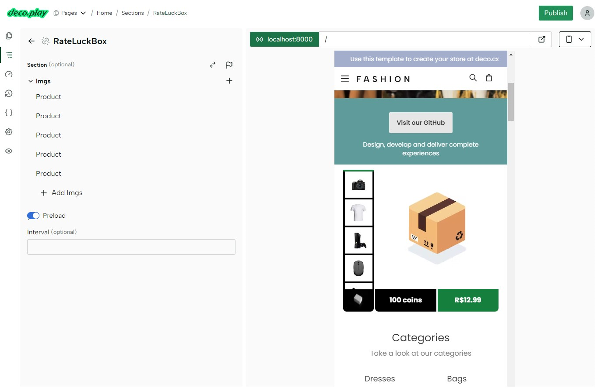

# 💻 Storefront starter by deco.cx

A fully featured starter to help you customize and deploy an ecommerce website.
in minutes.

<div style="display: flex; justify-content: center; width: 100%">

</div>

## ✨ Features

⇝ This starter brings a lot, but only this 'Loot Box Product' will be created:

<p align="center">
  
</p>

## 🚀 Getting started

To execute this website on your machine, clone it to your local machine with
`git clone` and make sure [deno is installed](https://deno.land/manual@v1.31.1/getting_started/installation).

Then open the terminal, change the directory to where fashion was cloned and type:

```sh
deno task start
```

⇝ Check performance best practices on [deco.cx's docs](https://www.deco.cx/docs).
